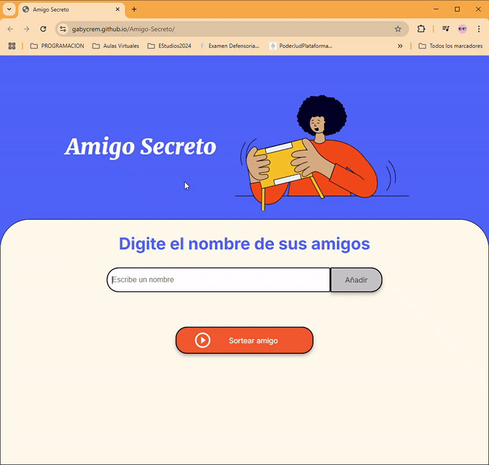

---

# 🎉 Amigo Secreto - Challenge Alura Latam

Este proyecto es mi solución al challenge **Amigo Secreto** de Alura Latam, creado para poner en práctica mis habilidades de desarrollo web. La aplicación permite gestionar un sorteo de amigo secreto, asegurando que no haya participantes repetidos y brindando una experiencia dinámica e interactiva.

---

## 🚀 Descripción

La aplicación de **Amigo Secreto** te permite:

- **Agregar amigos** de manera sencilla.
- **Validar entradas** para evitar nombres vacíos o duplicados.
- **Realizar un sorteo aleatorio** que asigna un amigo secreto a cada participante.
- **Visualizar la lista** de amigos.
  
Todo se realiza de manera interactiva con la ayuda de **HTML, CSS y JavaScript**.

---

## 🔧 Características

- **Interactividad**: Los usuarios pueden agregar amigos a la lista de manera fácil.
- **Validación de entradas**: El sistema verifica que los nombres no estén vacíos y no se repitan.
- **Sorteo aleatorio**: Al finalizar el proceso de inscripción, el sistema realiza un sorteo de forma 100% aleatoria.
- **Estilo sencillo y moderno**: La interfaz de usuario es limpia, amigable y accesible.

---

## 🌐 Demo

Puedes ver una demostración en vivo [aquí](https://gabycrem.github.io/Amigo-Secreto/) (si decides desplegarlo en GitHub Pages o cualquier otro servicio).

---

## 🎥 Demo en Acción

Aquí tienes una vista previa de la aplicación en acción:



---

## 📋 Requisitos

Para ejecutar este proyecto solo necesitas:

- Un navegador moderno (Chrome, Firefox, Safari, etc.).
- Si deseas realizar modificaciones, te recomiendo tener **Node.js** instalado (opcional).

---

## 🖥️ Instalación

1. **Clonar el repositorio**:
   ```bash
   git clone https://github.com/Gabycrem/Amigo-Secreto.git
   ```
2. **Acceder al directorio del proyecto**:
   ```bash
   cd Amigo-Secreto
   ```
3. **Abrir el archivo `index.html` en tu navegador**.

---

## ⚙️ Tecnologías utilizadas

- **HTML5**: Estructura y contenido de la página.
- **CSS3**: Diseño y estilo visual.
- **JavaScript**: Funcionalidad para manejar la lógica del sorteo, agregar y eliminar participantes, y las validaciones.

---

## 🤝 Contribuciones

¡Contribuciones son muy bienvenidas! Si tienes alguna idea para mejorar el proyecto, siéntete libre de hacer un **fork**, crear una nueva rama y enviar un **pull request**.

1. Haz un fork del repositorio.
2. Crea una rama nueva:
   ```bash
   git checkout -b mejora-nueva
   ```
3. Realiza tus cambios y haz un commit:
   ```bash
   git commit -m "Añadí una nueva mejora"
   ```
4. Envía un pull request explicando las mejoras.

---

## 🧑‍💻 Autor

Este proyecto fue realizado por **Nazarena Gabriela Macre** como parte de mi aprendizaje y desafío en **Alura Latam**.

- GitHub: [Gabycrem](https://github.com/Gabycrem)
- Email: [gabymacre@gmail.com](mailto:gabymacre@gmail.com)

---

## 📄 Licencia

Este proyecto está bajo la licencia **MIT**. Puedes ver más detalles en el archivo `LICENSE`.

---

¡Gracias por tu interés en mi proyecto! 🙌🎉

---
