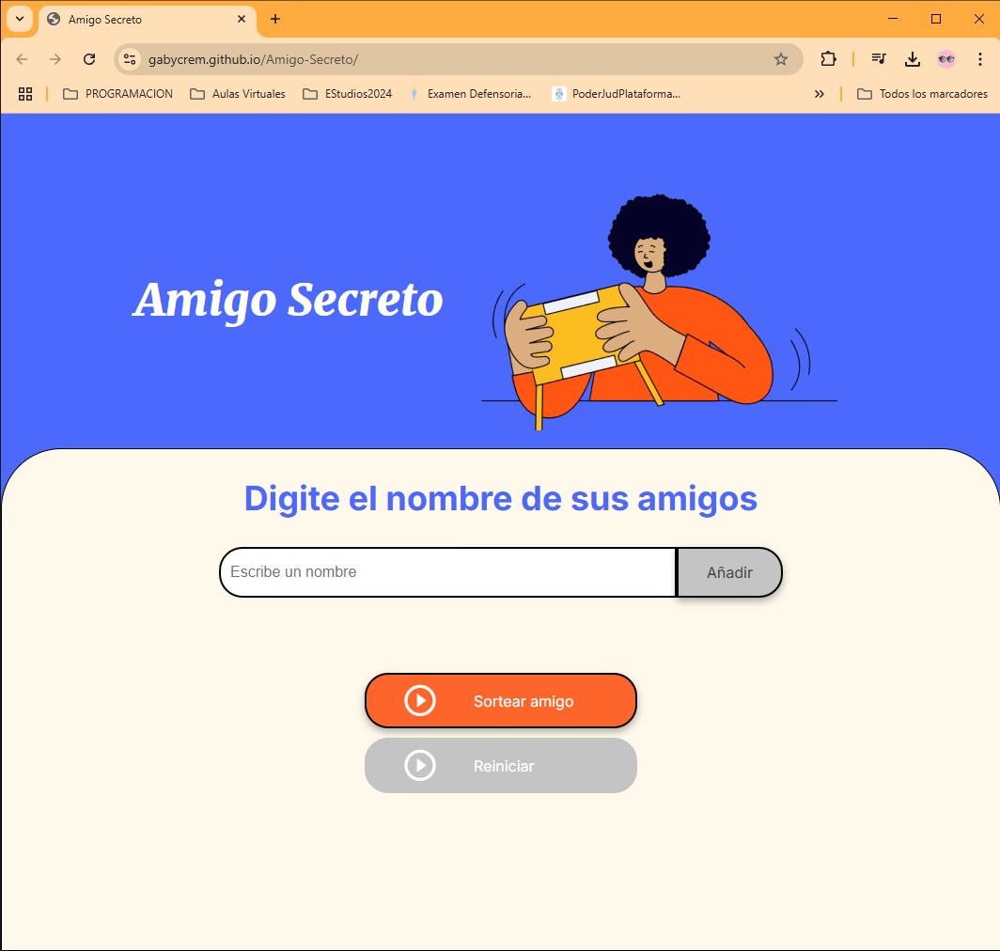
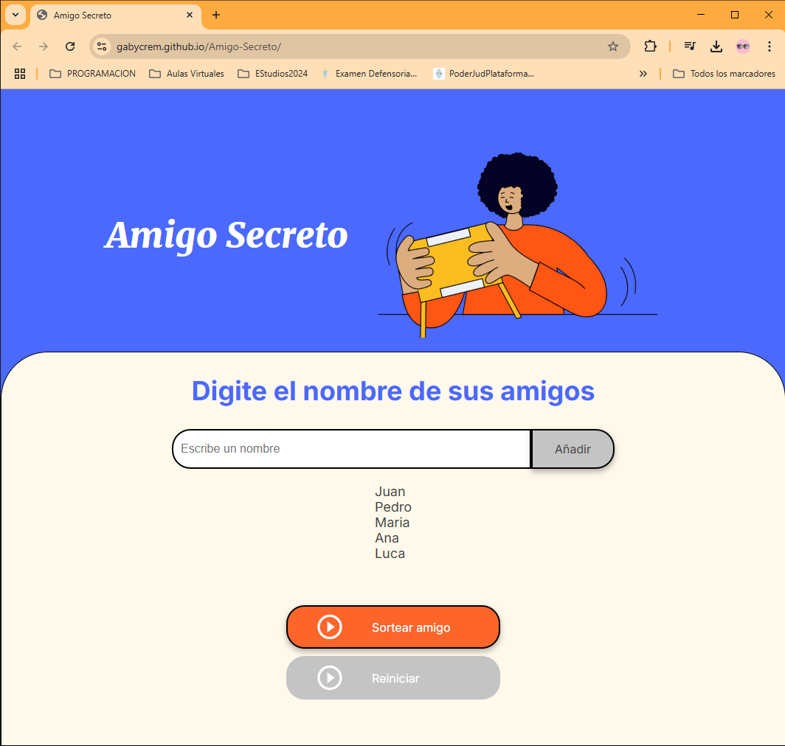
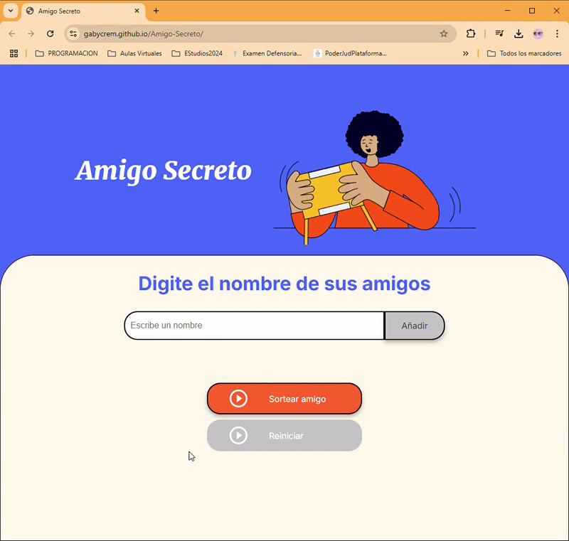

Aquí tienes la versión mejorada de tu README con todas las sugerencias integradas:  

---  

# 🎉 Amigo Secreto - Alura Latam Challenge  

**Amigo Secreto** es una aplicación interactiva desarrollada como parte del desafío de **Alura Latam**. Esta herramienta facilita la gestión de sorteos de amigo secreto de manera dinámica, asegurando que todos los participantes tengan una experiencia divertida y sin errores.  

---  

## 🚀 Descripción  

La aplicación permite:  

- **Agregar amigos** de manera sencilla.  
- **Validar entradas** para evitar nombres vacíos o duplicados.  
- **Realizar un sorteo aleatorio** que asigna un amigo secreto a cada participante.  
- **Visualizar la lista** de amigos.  

Todo se realiza de manera interactiva con la ayuda de **HTML, CSS y JavaScript**.  

---  

## 🛠️ Funcionalidades  

### 1. **Agregar amigos**  
   - Permite añadir nombres a la lista ingresándolos en el campo de texto.  
   - Valida que los nombres no estén vacíos ni duplicados.  
   - Muestra los nombres ingresados en una lista visual dentro de la página.  

### 2. **Sortear un amigo secreto**  
   - Escoge un nombre al azar de la lista ingresada.  
   - Valida que existan al menos 2 nombres para realizar el sorteo.  
   - Muestra el resultado en pantalla y desactiva el botón de sorteo.  

### 3. **Reiniciar sorteo** *(Funcionalidad nueva)*  
   - Limpia la lista de amigos y el resultado del sorteo.  
   - Habilita nuevamente el botón de sorteo para realizar múltiples sorteos.  

---  

## 🌟 Próximas mejoras  

- Validación para nombres con caracteres especiales.  
- Implementar un contador visual del número de amigos ingresados.  
- Mejorar la experiencia visual con animaciones.  

---  

## 🌐 Demo  

Puedes ver una demostración en vivo alojada en GitHub Pages:  
[https://gabycrem.github.io/Amigo-Secreto/](https://gabycrem.github.io/Amigo-Secreto/).  

---  

## 📸 Capturas de pantalla  

### Pantalla principal  
 

### Pantalla principal con amigos cargados  


### Resultado del sorteo  
  

### Demo en acción  
  

---  

## 💻 Tecnologías utilizadas  

- **HTML5**: Estructura y contenido de la página.  
- **CSS3**: Diseño y estilo visual.  
- **JavaScript**: Funcionalidad para manejar la lógica del sorteo, agregar y eliminar participantes, y las validaciones.  

---  

## 📋 Requisitos  

Este proyecto no requiere configuración adicional. Simplemente abre `index.html` en tu navegador y ¡listo para usar!  

Si deseas realizar modificaciones, es recomendable tener instalado **Node.js** (opcional).  

---  

## 🖥️ Instalación  

1. **Clonar el repositorio**:  
   ```bash  
   git clone https://github.com/Gabycrem/Amigo-Secreto.git  
   ```  
2. **Acceder al directorio del proyecto**:  
   ```bash  
   cd Amigo-Secreto  
   ```  
3. **Abrir el archivo `index.html` en tu navegador**.  

---  

## 🤝 Contribuciones  

¡Contribuciones son muy bienvenidas! Si tienes alguna idea para mejorar el proyecto, siéntete libre de hacer un **fork**, crear una nueva rama y enviar un **pull request**.  

1. Haz un fork del repositorio.  
2. Crea una rama nueva:  
   ```bash  
   git checkout -b mejora-nueva  
   ```  
3. Realiza tus cambios y haz un commit:  
   ```bash  
   git commit -m "Añadí una nueva mejora"  
   ```  
4. Envía un pull request explicando las mejoras.  

---  

## 🧑‍💻 Autor  

Este proyecto fue realizado por **Nazarena Gabriela Macre** como parte de mi aprendizaje y desafío en **Alura Latam**.  

- GitHub: [Gabycrem](https://github.com/Gabycrem)  
- Email: [gabymacre@gmail.com](mailto:gabymacre@gmail.com)  

---  

## 📄 Licencia  

Este proyecto está bajo la licencia **MIT**. Puedes ver más detalles en el archivo `LICENSE`.  

---  

Espero que disfrutes usar esta aplicación tanto como yo disfruté desarrollarla. ¡Cualquier comentario o sugerencia es bienvenido! 🙌🎉  

---  
